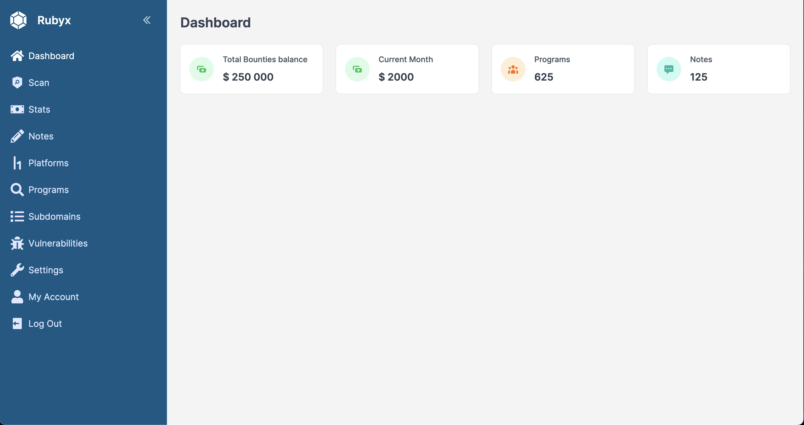
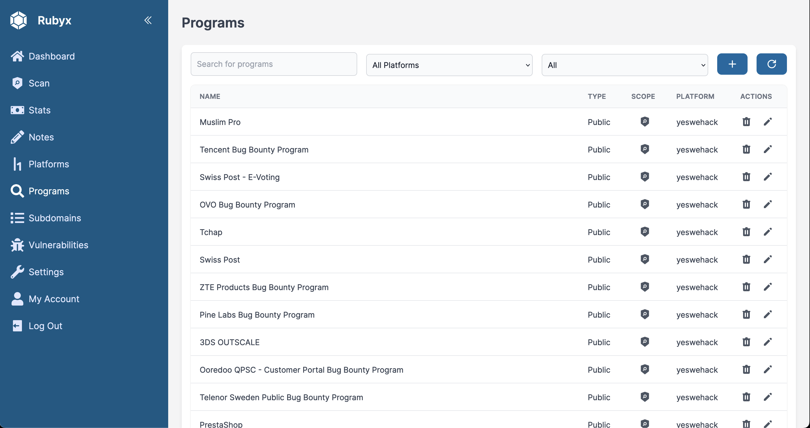
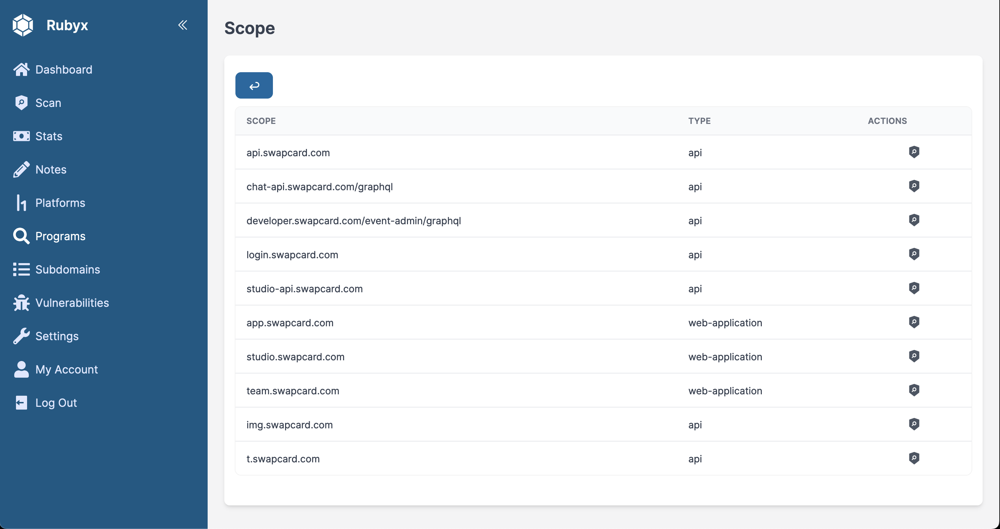
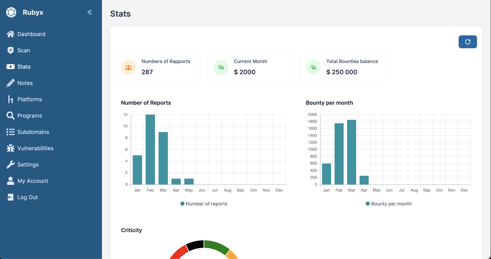

# Rubyx

Rubyx is an easy to use dashboard for Bug Hunter to manage your data, your recon and your stats.

<p align="center">  
    <a href="https://opensource.org/licenses/MIT"></a>  
    <a href="https://github.com/aituglo/rubyx-dashboard/issues"></a>
</p>

## Quick Start

```bash
# clone the repo
git clone https://github.com/aituglo/rubyx-dashboard.git && cd rubyx-dashboard

# copy the .env template for your local version
cp .env.example .env

# build and start the containers
docker compose up --build

# Init the first user
docker compose run golang go run initdb.go
```

1) Visit `https://localhost` (*note **https***)

2) You can connect with admin@admin.com:passw0rd

## Preview of the dashboard






## Thanks

Rubyx is inspirated by Hunt3r, and I use [WappaGo](https://github.com/EasyRecon/wappaGo), made by [Serizao](https://github.com/Serizao) and [Jomar](https://github.com/JoshuaMart).
